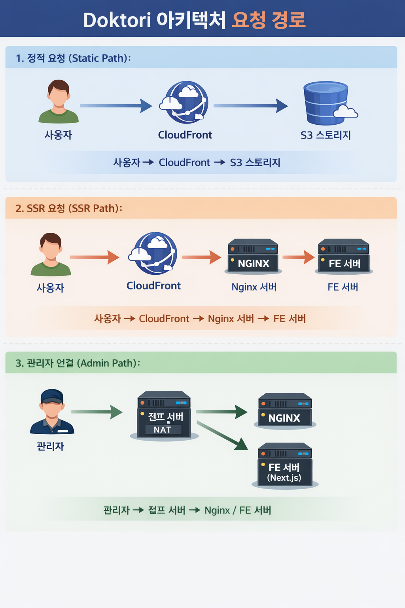
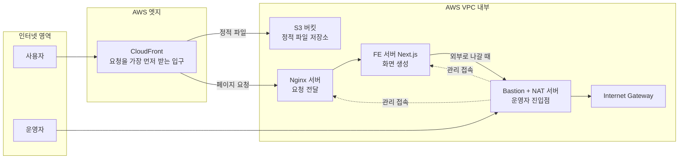

# Doktori 현재 구조 (쉬운 설명)

## 1) 한눈에 보는 흐름

## 2) 각 구성요소 역할
- `CloudFront`
  - 사용자 요청을 가장 먼저 받는 전면 입구
  - 빠른 응답과 캐시 역할
- `S3`
  - 정적 파일(이미지, js, css 등) 저장
- `Nginx`
  - 페이지 요청을 FE 서버로 전달
- `FE 서버 (Next.js)`
  - 실제 HTML/화면을 생성해서 응답
- `Bastion`
  - 운영자가 내부 서버에 접속할 때 거치는 관리 서버
  - Private 서버의 인터넷 아웃바운드(NAT 역할)도 담당

## 3) 요청이 가는 길
1. 정적 파일 요청:
   - `사용자 -> CloudFront -> S3`
2. 페이지 요청(SSR):
   - `사용자 -> CloudFront -> Nginx -> FE 서버`
3. 운영자 관리 접속:
   - `운영자 -> Bastion -> (Nginx/FE)`

## 4) 현재 상태 한 줄 요약
- 인프라 연결은 완료
- 다만 FE 앱(3000 포트)이 아직 떠있지 않아, 페이지 요청은 현재 Nginx 기본 페이지가 응답 중
